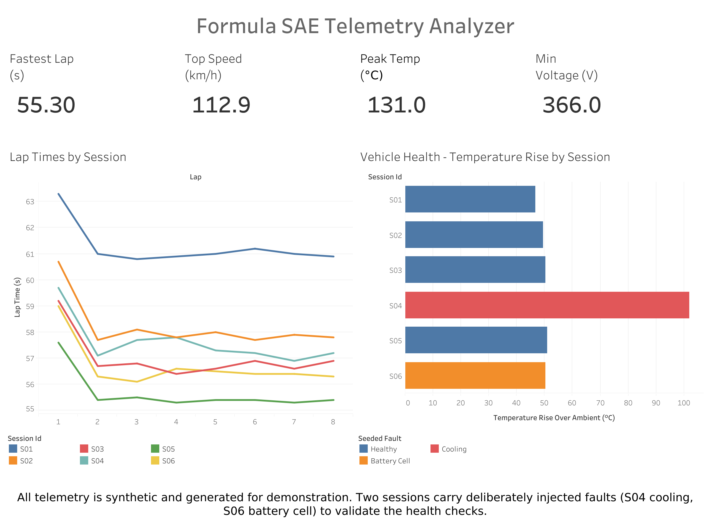

# Formula SAE Telemetry Analyzer

A synthetic telemetry pipeline for a Formula SAE-style race car: simulate a session, clean it, load it into SQLite, analyse it with SQL and Python, and publish the results to a Tableau dashboard.

## Dashboard

**[View the live dashboard on Tableau Public →](https://public.tableau.com/app/profile/rayyan.rizvi/viz/FormulaSAETelemetryAnalyzer/TelemetryDashboard)**



Four KPIs across the top (fastest lap, top speed, peak temperature, minimum voltage), lap times per session on the left, and temperature rise over ambient on the right, coloured by seeded fault. The packaged workbook is in `dashboard/telemetry_dashboard.twbx` and opens with its data bundled.

## Project Overview

The project simulates six driving sessions on a fictional 1,100 m autocross circuit, sampling at 10 Hz to produce 27,765 telemetry rows. From that raw signal it derives lap times, sector splits, speed traces, thermal behaviour, and battery load.

## Why I Built It

I'm on the Electrical & Software Systems subteam for Queen's University Racing, where a lot of my work is validating CAN communication and tracing sensor and telemetry faults across test sessions. That work is diagnostic and mostly happens live at the track; you look at data, spot something wrong, and chase it down. I wanted to build the other half: a repeatable pipeline that takes raw telemetry and turns it into lap analysis and automated health checks, so the questions we ask by eye during a session could be answered systematically afterward.

## Synthetic Data Disclaimer

**All telemetry in this project is synthetic.** There is no real car, no real track, and no real driver. Every value is produced by a physics-based simulation in `src/generate_telemetry.py` using a fixed random seed (`20260918`), so the entire dataset is reproducible from scratch by anyone who clones the repo.

The track is fictional. The vehicle parameters are chosen to be plausible for a Formula SAE car but do not model any specific design. The faults in sessions S04 and S06 were injected on purpose to give the health checks something real to detect.

## Technologies

| Area | Tools |
|---|---|
| Simulation & analysis | Python 3.12, pandas, NumPy |
| Database | SQLite (schema, foreign keys, CHECK constraints, indexes) |
| Querying | SQL (CTEs, window functions, conditional aggregation) |
| Testing | pytest |
| Visualisation | Jupyter, matplotlib, Tableau Public |

## How the Simulation Works

The simulation is time-stepped rather than sampled from a distribution. It runs a virtual car around a virtual lap at 10 Hz and records what the sensors would have seen.

**The track** (`src/track.py`) is modelled as a single distance line from 0 m to 1,100 m, divided into eight named sections and three timing sectors. Each section carries a target speed, a corner severity, and a steering direction.

**The vehicle** (`src/vehicle.py`) holds mass, drag, power, braking, thermal and electrical parameters.

**The driver** aims for each section's target speed, brakes for corners in proportion to their severity, and carries a per-session aggression and consistency setting. This is what separates the six sessions from one another.

**Lap time is counted, not generated.** The simulation does not decide in advance how long a lap will take. It steps the car forward at 0.1s intervals and the lap time falls out of how long the car took to cover 1,100m. This matters: it means lap time, speed trace, and sector splits are all consequences of the same underlying motion, and they reconcile with each other because they have to.

**The six sessions:**

| ID | Label | Samples |
|---|---|---|
| S01 | Cool morning shakedown | 4,909 |
| S02 | Baseline practice | 4,665 |
| S03 | Hot afternoon running | 4,569 |
| S04 | Cooling system degraded | 4,617 |
| S05 | Push session | 4,461 |
| S06 | Weak cell under load | 4,544 |

S04 and S06 carry the seeded faults: degraded cooling and a weak battery cell under load.

## Features

- **Physics-based telemetry generation** at 10 Hz across six sessions and 48 laps
- **Validation on ingest** — missing values, out-of-range readings, duplicate samples and non-monotonic laps are all checked and reported
- **Normalised SQLite database** with four tables, foreign keys, CHECK constraints and indexes
- **12 SQL queries** covering session summaries, lap rankings, sector strengths and vehicle health, using CTEs, `RANK()`, `LAG()`, `CASE` and conditional aggregation
- **Distance-aligned lap comparison** on a 5 m grid, so two laps can be compared metre by metre rather than second by second
- **Automated health checks** that classify temperature, voltage and RPM against defined thresholds
- **12 pytest tests** covering the simulation, the analysis layer and the reconciliation between them
- **Jupyter notebook** with seven plots, rendered inline on GitHub
- **Tableau dashboard**, published and linked above

## Project Structure

```
Formula-SAE-Telemetry-Analyzer/
├── src/
│   ├── track.py                 # Fictional circuit: 8 sections, 3 sectors, 1100 m
│   ├── vehicle.py               # Vehicle parameters and limits
│   ├── generate_telemetry.py    # 10 Hz time-stepped simulation
│   ├── clean_telemetry.py       # Validation, cleaning, lap and sector aggregation
│   ├── database.py              # SQLite schema creation and loading
│   ├── run_sql.py               # Named-query runner for the .sql files
│   ├── analysis.py              # Session reports, consistency, health checks
│   ├── lap_comparison.py        # Distance-aligned lap-vs-lap comparison
│   ├── export_results.py        # CSV exports for the dashboard
│   └── main.py                  # Full pipeline entry point
├── sql/
│   ├── schema.sql               # Tables, foreign keys, constraints, indexes
│   ├── lap_analysis.sql         # Lap and session performance queries
│   └── vehicle_health.sql       # Health and fault-detection queries
├── tests/
│   ├── test_telemetry.py        # Simulation and data integrity tests
│   └── test_analysis.py         # Analysis and health-check tests
├── notebooks/
│   └── telemetry_analysis.ipynb # Seven plots, renders on GitHub
├── dashboard/
│   └── telemetry_dashboard.twbx # Packaged Tableau workbook
├── docs/
│   └── dashboard_overview.png   # Published dashboard screenshot
├── data/                        # Committed so the repo works without running the pipeline
│   ├── raw/                     # Raw simulated samples
│   ├── processed/               # Cleaned data and summaries
│   ├── exports/                 # CSVs for Tableau
│   └── telemetry.db             # SQLite database (gitignored, regenerated on run)
├── requirements.txt
└── README.md
```

## How to Run

Requires Python 3.12+.

```bash
git clone https://github.com/Rayyan-Rizvi/Formula-SAE-Telemetry-Analyzer.git
cd Formula-SAE-Telemetry-Analyzer

python3 -m venv .venv
source .venv/bin/activate        # Windows: .venv\Scripts\activate

pip install -r requirements.txt

python -m src.main
```

The full pipeline runs in about a second and writes everything into `data/`.

Individual stages can be run on their own:

```bash
python -m src.generate_telemetry   # Simulate raw telemetry
python -m src.clean_telemetry      # Validate, clean, aggregate
python -m src.database             # Build and load the SQLite database
python -m src.run_sql              # Execute the named SQL queries
python -m src.analysis             # Session report and health checks
python -m src.lap_comparison       # Distance-aligned lap comparison
python -m src.export_results       # Write CSVs for the dashboard
```

Run the tests:

```bash
pytest
```

## Example Analysis

Output from `python -m src.main`, abbreviated:

**Session summary**

| Session | Label | Best lap (s) | Avg lap (s) | Top speed (km/h) |
|---|---|---|---|---|
| S05 | Push session | 55.3 | 55.66 | 112.94 |
| S06 | Weak cell under load | 56.1 | 56.70 | 112.91 |
| S03 | Hot afternoon running | 56.4 | 57.01 | 112.91 |
| S04 | Cooling system degraded | 56.9 | 57.61 | 112.94 |
| S02 | Baseline practice | 57.7 | 58.21 | 112.90 |
| S01 | Cool morning shakedown | 60.8 | 61.26 | 111.88 |

**Lap consistency** (out-lap excluded)

| Session | Mean lap (s) | Std dev (s) | Range (s) | Variation (%) |
|---|---|---|---|---|
| S05 | 55.39 | 0.069 | 0.2 | 0.125 |
| S01 | 60.97 | 0.125 | 0.4 | 0.205 |
| S02 | 57.86 | 0.151 | 0.4 | 0.261 |
| S06 | 56.37 | 0.160 | 0.5 | 0.284 |
| S03 | 56.70 | 0.183 | 0.5 | 0.323 |
| S04 | 57.31 | 0.324 | 0.9 | 0.565 |

S05 is quickest on both pace and repeatability. S04 is the least consistent, which is the cooling fault showing up in lap time rather than in a temperature reading.

**Vehicle health**

| Session | Ambient (°C) | Peak (°C) | Rise (°C) | Min voltage (V) | Status |
|---|---|---|---|---|---|
| S01 | 16.0 | 62.7 | 46.7 | 380.1 | OK |
| S02 | 21.0 | 70.5 | 49.5 | 380.5 | OK |
| S03 | 33.0 | 83.4 | 50.4 | 380.3 | OK |
| S04 | 29.0 | 131.0 | 101.9 | 380.2 | **ATTENTION** |
| S05 | 24.0 | 74.9 | 50.9 | 380.1 | OK |
| S06 | 23.0 | 73.4 | 50.3 | 366.0 | **ATTENTION** |

```
[ATTENTION] S04: peak powertrain temperature 131.0 C, 101.9 C above ambient
            (+51.6 C versus the field median rise)
[ATTENTION] S06: minimum pack voltage 366.0 V, below the 375 V watch threshold
```

Both seeded faults are flagged. No healthy session is.

The temperature rise metric is what makes this work. S03 ran on a hot day and reached 83.4 °C, which looks alarming in isolation — but its rise over ambient is 50.4 °C, right in line with the healthy sessions. S04 reached 131.0 °C on a cooler day, a 101.9 °C rise. Comparing against ambient rather than an absolute threshold separates a hot day from a broken cooling system.

## SQL Analysis

Twelve named queries live in `sql/lap_analysis.sql` and `sql/vehicle_health.sql`. Each is preceded by a `-- name: <id>` marker, and `src/run_sql.py` splits the files on those markers so any query can be run by name.

**Schema** (`sql/schema.sql`) — four tables with foreign keys, CHECK constraints and indexes:

- `sessions` — one row per session, with conditions and driver settings
- `laps` — one row per lap, foreign-keyed to `sessions`
- `sectors` — three rows per lap, foreign-keyed to `laps`
- `telemetry` — the raw 10 Hz samples

**Techniques used:**

| Technique | Where |
|---|---|
| CTEs | Sector strength comparison against field average |
| `RANK()` | Fastest laps overall, ranked within and across sessions |
| `LAG()` | Lap-over-lap deltas and improvement tracking |
| `CASE` | Health status classification |
| Conditional aggregation | Counting laps above/below thresholds per session |
| Multi-table joins | Relating lap results back to session conditions |

## Limitations

**Theoretical best lap sits within ±0.2 s of the actual best lap.** The theoretical best is built by taking each session's quickest time in each of the three sectors and summing them, which should normally come out meaningfully faster than any single real lap. Here it barely does.

The query is correct. The problem is upstream: sector times carry roughly 0.1 s of quantisation from 10 Hz sampling, and the driver model's sector-to-sector variation is of a similar size. There isn't enough spread in the simulated data for the metric to measure anything. I tried adding per-sector pace variation to the driver model and it didn't move the number, so the limitation is documented rather than papered over.

**The simulation is not a validated vehicle model.** It produces plausible telemetry, not accurate telemetry. Tyre behaviour, aerodynamics, suspension and powertrain response are all heavily simplified. Nothing here predicts how a real car would perform.

**Six sessions is a small sample.** The health checks compare each session against the field median, which is not a robust baseline with six data points. On a real dataset the thresholds would need to be derived from many more runs.

**Health thresholds are fixed constants.** `TEMP_HIGH_C`, `VOLTAGE_LOW_V` and the rest are hard-coded in `src/analysis.py` rather than learned from the data or taken from a manufacturer specification.

## Future Improvements

- Derive health thresholds from historical distributions instead of hard-coding them
- Add tire temperature and brake temperature channels
- Introduce per-sector pace variation large enough for the theoretical-best metric to be meaningful
- Support reading real CAN log formats so the same analysis layer could run on actual telemetry
- Add a lap-over-lap delta chart to the dashboard, not just aggregate views